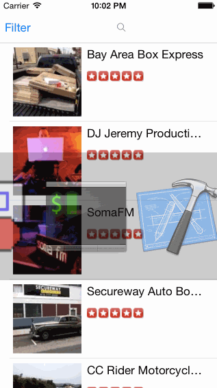

Yelp Search
======
Yelp Search App

This is an attempt to clone the Yelp search functionality. It leverages the [Yelp Api](http://www.yelp.ca/developers/documentation/v2/search_api).

Time spent: approximately 9 hours

Features
---------
#### Required
##### Search Results
- [x] Table Rows should be dynamic height according to the content height
- [x] Custom Cells should have proper Auto Layout constraints
- [x] Search bar should be in the navigation bar

##### Filter Page
- [x] Category, sort(best match, distance, highest rated), radius, deals filters
- [x] The filters table should be organized into sections as in the mock
- [ ] Use UISwitch for on/off states
- [ ] Radius filter should expand as in the real Yelp app
- [ ] Categories should show a subset of all Yelp Categories, and have a "See All" row
- [ ] Clicking on the "Search" button should dismiss the filters page and trigger the search w/ the new filter settings

Walkthrough
------------

